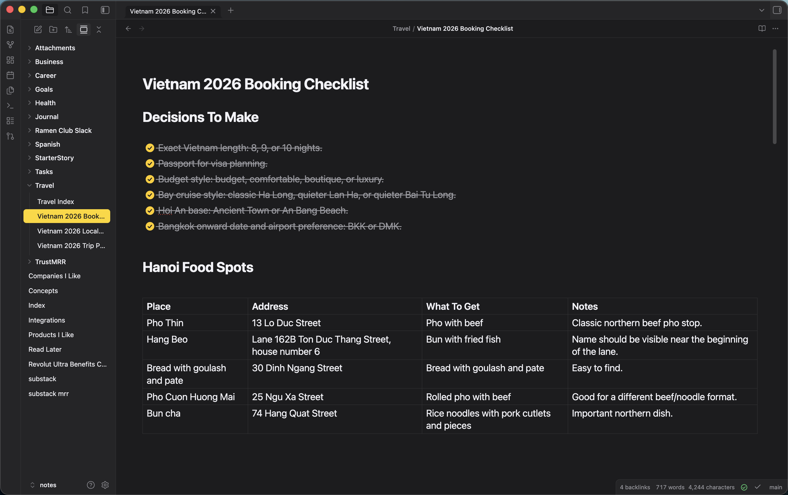

# Apple Notes theme for Obsidian

An Obsidian theme that mimics the look and feel of the **Apple Notes** app on macOS and iOS.

## Features

- Warm off-white paper in light mode, charcoal `#1C1C1E` in dark mode
- SF Pro font stack — matches the native macOS/iOS Notes typography
- Yellow accent (`#FFCC00` / `#F5B800`) for links, folder icons, active note, tags
- Round Apple-style checkboxes that fill gold with a white checkmark when done
- Yellow highlighter for `==marks==` and text selection
- Full-width editor with no line-number gutter — feels like a paper note, not a code file
- Pill-shaped yellow tags
- Rounded modals with translucent backdrop
- Both light and dark modes

## Install

### From the community themes gallery (once approved)

1. Open **Settings → Appearance → Themes → Manage**
2. Search for "Apple Notes"
3. Install and apply

### Manually

1. Download `manifest.json` and `theme.css` from the [latest release](../../releases/latest)
2. Copy them into `<your-vault>/.obsidian/themes/Apple Notes/`
3. In Obsidian: **Settings → Appearance → Themes → Apple Notes**

## Recommended settings

For the closest match to real Apple Notes:

- **Settings → Editor → Show line number**: off
- **Settings → Editor → Readable line length**: your preference (the theme respects it either way and expands to full width when off)
- **Settings → Appearance → Base color scheme**: switch freely between light/dark — both are tuned

## Credits

Built by Alex Simion. Inspired by Apple Notes on macOS Sonoma and iOS 17.

## License

[MIT](LICENSE)
